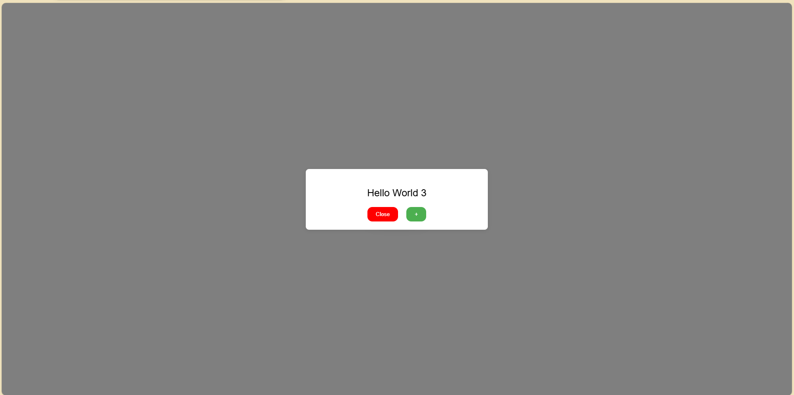

# USUEROLOGY R1 Assignment: Create a Popup Window with Close and Open Buttons

## Summary:

This assignment involves creating a popup window with a "Close" button and a "+" button. When the "+" button is clicked, a new popup window with an incremented counter is opened. The popup window is styled to have a good UI and is centered on the screen.

## Key Features:

Created a popup window with a "Close" button and a "+" button
Implemented functionality to open a new popup window with an incremented counter when the "+" button is clicked
Styled the popup window to have a good UI and centered it on the screen
Files:

`index.html`: The main HTML file
`styles.css`: The CSS file for styling the popup window
`script.js`: The JavaScript file for implementing the functionality

Output:

